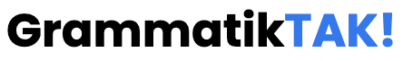

  

  

## What is GrammatikTAK?

Working on becoming the best grammar assistant for nordic languages with a combination of NLP, AI and Linguists.

This currently only corrects danish text at [**GrammatikTAK.com.**](https://www.grammatiktak.com) Models and datasets are not included in this repo.

## Why?
The rise in NLP and AI has greatly affected popular languages, their respective grammar assistants and NLP work. The nordic, especially danish, are sadly way behind. This repo is hopefully going to help cover some basic NLP needs and make a great danish, an potential nordic, grammar assistant.

## Design principles
**GrammatikTAK** is:

- **Simple**: Build in [modules](https://github.com/Apros7/GrammatikTAK/tree/main/GrammatiktakBackend), a module can easily be replaced, reworked or even deleted without affecting other modules.
- **Adaptable**: Although speed is important, we focus on adaptability and readability over speed.
- **Well-tested**: Every module is [well-tested](https://github.com/Apros7/GrammatikTAK/tree/main/FineTuneModels) to secure a high accuracy.

## Directories:

Here is a small overview of the most important directories:

* BackendAssistants: Scripts for analysing the backend performance & complexity.
* DataProcessing: Scripts & notebooks for converting text to datasets.
* FineTuneModels: Scripts for finetuning models and logging performance
* GoogleDocsAddOn: Scripts for the GrammatikTAK Google Docs Add-on
* GoogleExtension: Scripts for the GrammatikTAK Google Extension (not finished)
* GrammatiktakBackend: development of backend 2.0. main.py is the backend. Currently used.
* Other: Powerpoints
* TestingOtherModels: Scripts for testing models from other people to use or compare with.
